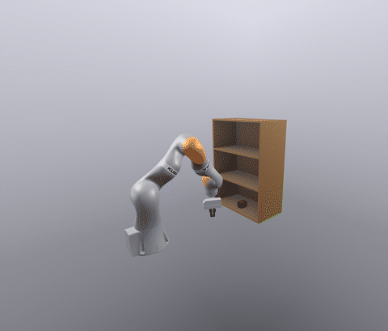
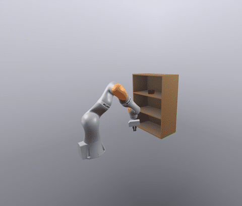
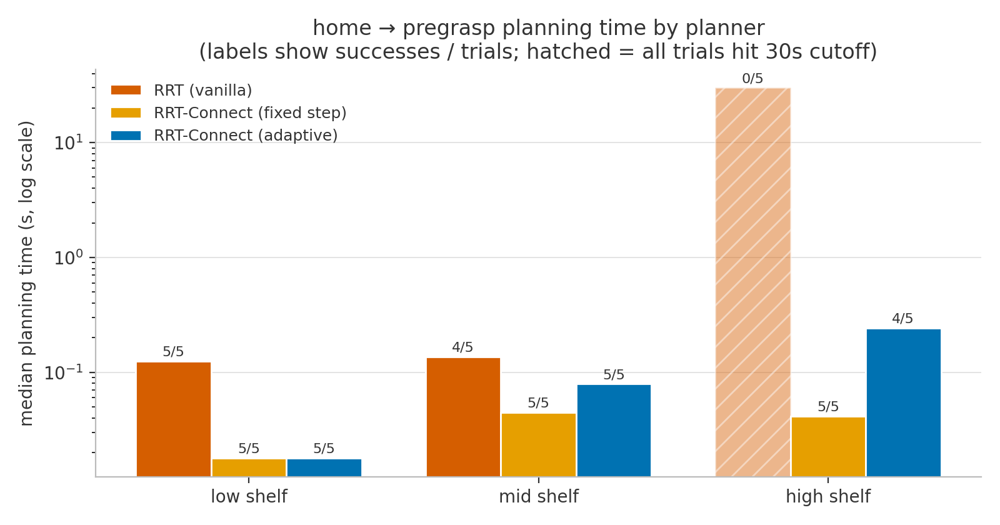
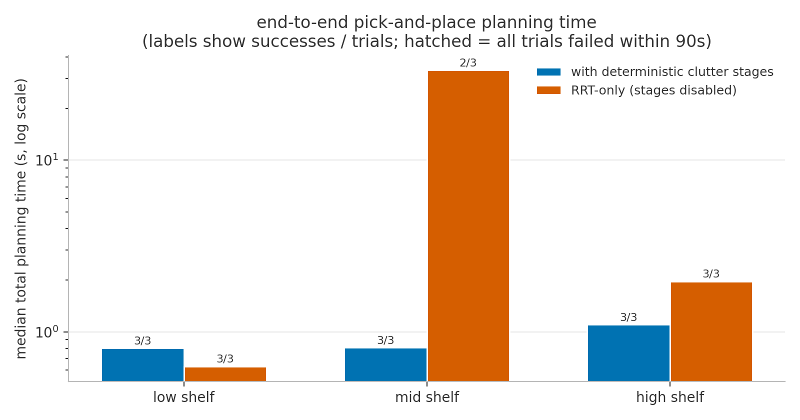
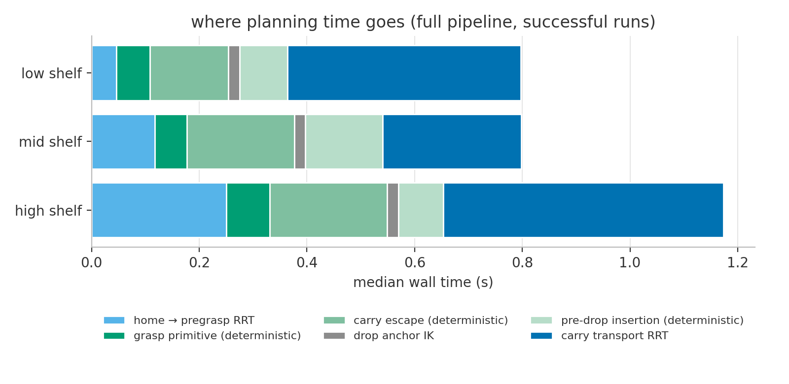

# Sampling-Based Motion Planning for Shelf Pick-and-Place

**Adaptive RRT-Connect with deterministic clutter-escape primitives, on a KUKA iiwa in Drake.**

<table align="center">
  <tr>
    <td align="center"><br/><sub><b>low&nbsp;shelf&nbsp;→&nbsp;mid&nbsp;shelf</b></sub></td>
    <td align="center"><br/><sub><b>low&nbsp;shelf&nbsp;→&nbsp;high&nbsp;shelf</b></sub></td>
  </tr>
  <tr>
    <td align="center"><br/><sub><b>mid&nbsp;shelf&nbsp;→&nbsp;high&nbsp;shelf</b></sub></td>
    <td align="center"><br/><sub><b>high&nbsp;shelf&nbsp;→&nbsp;low&nbsp;shelf</b></sub></td>
  </tr>
  <tr>
    <td align="center"><br/><sub><b>low&nbsp;shelf&nbsp;→&nbsp;top&nbsp;of&nbsp;shelf</b></sub></td>
    <td align="center"><br/><sub><b>mid&nbsp;shelf&nbsp;→&nbsp;low&nbsp;shelf</b></sub></td>
  </tr>
</table>
<p align="center"><em>
One planner, six tasks. Each clip is a complete run — reach into the start compartment, grasp the
brick, extract it through the shelf mouth, carry it, and place it at the exact requested pose —
planned in ≈1&nbsp;s each (with path shortcutting enabled) and executed in Drake over LCM. Green
traces show planned end-effector waypoints. Playback is 4× real time.
</em></p>

The user specifies where the brick starts (a shelf level) and the exact 6-DoF pose where it must end up.
The system solves everything in between: inverse kinematics for the task anchors, collision-free
joint-space motion through a narrow-passage environment, grasping, payload-aware transport, and
placement — then executes the plan in simulation through the same LCM command interface a real iiwa uses.

---

## Why this problem is interesting

A shelf is close to a worst case for sampling-based planners. In configuration space, each
compartment is a **narrow passage**: uniform samples rarely land inside it, so a naive RRT
effectively never finds its way in. Grasping makes it harder still — once the brick is attached,
the arm+payload body is larger, the required clearance is stricter, and the planner has to solve
*extraction*, *transport*, and *insertion* in a single search.

This project attacks that structure directly, with two complementary ideas:

1. **Adaptive RRT-Connect** — a bidirectional RRT whose local step size, sampling domain, and
   greediness adapt online to the geometry each tree node actually experiences (small careful
   steps inside clutter, long aggressive steps in free space).
2. **Deterministic clutter interpolation** — short motions near contact (grasp approach, shelf
   extraction, final insertion) should not be left to a random search at all. They are planned as
   straight task-space lines, solved by sequentially warm-started IK and validated segment-by-segment,
   with the line's length chosen by the collision checker's *measured clearance* rather than by
   hand-tuned offsets. The random search is reserved for the one part of the problem that genuinely
   needs it: global transport.

The result: end-to-end planning for the middle-shelf task dropped from **~33 s (2/3 success)** to
**~0.8 s (3/3 success)** — a ~40× speedup at higher reliability (see [Results](#results)).

## System architecture

Planning is orchestrated by a task-level finite-state machine
([`src/manipulation/manipulation_fsm.py`](src/manipulation/manipulation_fsm.py)) that decomposes
pick-and-place into motion *regimes* and picks the right tool for each:


- **Anchor states** (pre-grasp, grasp, drop) come from Drake's optimization-based IK
  ([`src/planning/IK.py`](src/planning/IK.py)) with randomized multi-start seeding, since the
  problem is non-convex.
- **Near-contact motions** (grasp approach/retreat, shelf extraction, insertion) are deterministic
  straight lines in task space. Grasping tries a small ordered ladder of variants — centered on the
  brick first, then gripping slightly above the centerline (with extra retreat lift) for
  compartments with a low ceiling, which is what makes the top shelf pickable.
- **Global transport** (home→pre-grasp, carry→pre-drop) is solved by the adaptive RRT-Connect,
  searching over a *batch* of IK-feasible drop candidates simultaneously and stopping at the first
  one that validates.
- If the exact requested pickup or drop pose is unreachable, the planner fails fast with an
  explicit *"location is not in reach"* error instead of silently succeeding somewhere nearby.

Each phase has different safety semantics, encoded as separate collision checkers built from one
factory ([`src/planning/collision.py`](src/planning/collision.py)) over Drake's SceneGraph
signed-distance queries:

| Checker | Used for | Clearance required | Payload handling |
|---|---|---|---|
| strict transit | home → pre-grasp | ≥ 10 mm | — |
| grasp | approach to brick | penetration-free | brick ignored (it is the target) |
| de-approach | retreat after grasp | penetration-free, 12 cm horizon | brick rigidly attached |
| carry | transport & drop search | ≥ 17 mm | brick rigidly attached |
| pre-drop probe | staging-distance estimation | (measurement only, 30 cm horizon) | brick rigidly attached |

After the grasp closes, the brick is re-parented into the kinematic chain: every subsequent
collision query moves the brick rigidly with the gripper frame, so "the arm is safe" always means
"the arm *and its payload* are safe."

## The planning stack

### Adaptive RRT-Connect

The core planner ([`src/planning/rrt_connect.py`](src/planning/rrt_connect.py)) is bidirectional
RRT-Connect [1] — two trees, one rooted at the start and one at the goal set, alternately extended
toward random samples and greedily connected to each other. On top of the classical structure, the
implementation layers a node-local adaptive controller inspired by adaptive-stepsize RRTs [2] and
dynamic-domain RRTs [3, 4]:

- **Node-local step scaling.** Every tree node carries its own preferred step scale. A failed
  extension shrinks it immediately; a successful one grows it and is inherited by the child. Nodes
  deep in the shelf converge to short careful steps while free-space nodes keep taking ~1 rad strides.
- **Collision-triggered backoff with memory.** When an aggressive extension collides, the same
  target is retried with geometrically smaller steps — and the step that finally *works* is
  remembered (EMA) rather than discarded, so the tree does not repeat the same mistake at that node.
- **Dynamic-domain sampling.** Nodes that keep failing stop attracting distant samples: each node
  exposes a shrinking sampling radius, and nearest-neighbor selection respects it. Exploration
  stays local exactly where the environment is hard.
- **Failure-node sampling.** A fraction of samples is drawn as Gaussian perturbations around
  recently trapped nodes — targeted effort at the frontier of the narrow passage.
- **Selective clearance queries.** Signed-distance queries are expensive, so clearance is measured
  only at nodes that have *proven* difficult (trapped at least once), then cached as a local step
  cap. Open-space expansion never pays for geometry queries it does not need.
- **Adaptive connect budgets.** The greedy `connect` phase is allowed thousands of steps through
  open space but only a small budget from failure-heavy nodes, preventing the classic RRT-Connect
  pathology of ratcheting along a wall.
- **Multi-goal search & fast paths.** The goal tree is rooted at every IK-feasible drop candidate
  at once, and a dense direct-edge check runs before any tree is built — many subproblems are
  solved by a single straight edge in joint space.
- **Search/validation split.** The search may grow through a relaxed (penetration-only) checker
  for speed, but every candidate path must pass dense validation under the strict checker before
  it is returned; where strictness defines feasibility (e.g. home→pre-grasp), search itself runs strict.
- **Smoothing as a post-process.** Exhaustive waypoint-pair shortcutting runs *after* search, on
  a cheap proposal checker, with one strict re-validation at the end — and the raw path is kept as
  a fallback, so smoothing can never turn a success into a failure.
- **Budgets & telemetry.** Deadlines propagate into every inner loop (edge checks, connect,
  shortcutting, IK multistart), and the planner reports counters (iterations, samples rejected,
  extensions trapped, candidate paths rejected at validation…) that made the failure modes in the
  [development log](notes/) diagnosable.

The full controller design, every parameter, and the rationale behind each choice are documented in
[`notes/adaptive_rrt_connect.md`](notes/adaptive_rrt_connect.md).

### Deterministic clutter interpolation

The single most effective idea in this project was recognizing that the *hardest-looking* parts of
the task — moving through the shelf mouth with the brick — are actually the *easiest* to plan, if
they are treated as structured motions instead of search problems.

The shared primitive (`build_axial_clearance_path` in
[`src/manipulation/manipulation_fsm.py`](src/manipulation/manipulation_fsm.py)) works as follows:

1. Anchor at a real kinematic state (the carried post-grasp state, or the exact drop configuration)
   and read the gripper's approach axis from forward kinematics.
2. March backwards along that axis in 1.5 cm increments, solving IK for each pose **seeded with the
   previous solution**, so the joint path stays continuous.
3. Reject any step whose state or connecting edge fails the strict payload-aware collision check.
4. Stop when the *measured* clearance of the carried payload exceeds a target (e.g. 20 cm of open
   space around the pre-drop staging pose), or when a stronger connectivity predicate fires (e.g.
   the carried state can already connect straight to home).

This is the "clutter-based linear interpolation" used in three places: the grasp approach
(pre-grasp → grasp), the carry escape (extracting the brick from the shelf), and the insertion
(pre-drop → exact drop, planned outward and reversed). Because the stopping rule is driven by the
collision checker's clearance estimate rather than fixed offsets, the same primitive works at any
shelf level — and would transfer to non-shelf environments with a defined approach axis.

The payoff is architectural: the transport RRT now starts *outside* the clutter and ends *outside*
the clutter. The narrow passages are simply no longer part of the random search.

## Results

All numbers are wall-clock, planning-only (`--plan_only`), measured on an Apple-silicon MacBook
with the benchmark harness in [`scripts/benchmark_planners.py`](scripts/benchmark_planners.py).
Raw per-trial data: [`assets/benchmarks/results.json`](assets/benchmarks/results.json).

### Planner comparison — reaching into the shelf

Home → pre-grasp planning with the strict transit checker, 5 seeded trials per cell, 30 s cutoff:

<p align="center"></p>

The bidirectional planners solve every level in tens of milliseconds. Vanilla RRT is fine when the
goal sits near the shelf opening (low/mid) but **fails all 5/5 trials on the high shelf**, where the
goal configuration lies deepest inside the narrow passage — the classic single-tree failure mode
that motivated RRT-Connect. Fixed-step and adaptive RRT-Connect are equivalent on these short
uncluttered queries (the adaptive controller's node-local bookkeeping only pays off once a payload
is attached and clearance tightens; one adaptive trial on the high shelf drew an unlucky seed and
hit the cutoff).

### Ablation — the deterministic clutter stages

End-to-end pick-and-place planning, with the deterministic stages enabled (straight-line grasp
approach + carry escape + pre-drop insertion) versus the same system forced to solve everything
with RRT alone. 3 seeded trials per cell, 90 s budget:

<p align="center"></p>

| Task | With deterministic stages | RRT-only |
|---|---|---|
| low shelf → top of shelf | **0.8 s** (3/3) | 0.6 s (3/3) |
| mid shelf → top of shelf | **0.8 s** (3/3) | 33.4 s (2/3) |
| high shelf → top of shelf | **1.1 s** (3/3) | 2.0 s (3/3) |

The low and high shelves are manageable either way — their extraction corridors open toward free
space, so the random search escapes them quickly. The middle shelf is the interesting case: with
the brick attached, the strict 17 mm carry clearance turns the compartment into a corridor the
random search struggles to escape. Structured extraction and insertion remove exactly that
corridor from the search, cutting median planning time **~40×** while improving reliability —
and, just as important, making the runtime *predictable across tasks* (≈1 s for every
pick/place combination shown in the collage above) instead of geometry-dependent.

### Where the remaining time goes

<p align="center"></p>

With the full pipeline, total planning sits around one second for every shelf level and is spread
across IK, deterministic staging, and the transport RRT — no single stage dominates, which is
where a planning stack wants to be before further tuning.

### Honest limitations

- **Grasping is a fixed variant ladder, not grasp synthesis.** The top shelf is only pickable
  because an above-centerline grasp variant keeps the wrist clear of the compartment ceiling —
  found by trying a small ordered set of grasp offsets. That works for a known brick; arbitrary
  objects would need a real grasp-pose sampler.
- The live entry point (`src/main.py`) runs unseeded for variety; benchmarks pin seeds for
  reproducibility, but individual runtimes remain sample-dependent.
- The stack is pure Python over Drake queries. Sub-100 ms planning would want a reusable roadmap
  or a C++/OMPL backbone — the current architecture (deterministic staging + single transport
  search) was designed so such a swap stays local.

## Running it

```bash
python3 -m venv .venv && source .venv/bin/activate
pip install -r requirements.txt

# Plan and execute in MeshCat (URL printed on startup; --open launches a browser).
python -m src.main --brick_shelf_level mid --drop_location high --open

# Planning-only benchmark of a single run.
python -m src.main --brick_shelf_level low --drop_location top --plan_only

# Unit / regression tests for the planner and FSM.
PYTHONPATH=. python tests/test_rrt_connect.py
PYTHONPATH=. python tests/test_manipulation_fsm.py

# Reproduce the figures above.
PYTHONPATH=. python scripts/benchmark_planners.py run
PYTHONPATH=. python scripts/benchmark_planners.py plot
```

`--brick_shelf_level {low,mid,high}` sets the brick's start pose and
`--drop_location {low,mid,high,top}` selects the placement target (a shelf compartment, or the top
of the shelf). In-shelf drop poses are derived by mirroring the pickup geometry at the target
location, so any pick/place combination uses the same machinery. After an executed run, a MeshCat
recording of the whole motion is saved to `rrt_connect.html` (or `--recording_out`) for offline replay.

## Repository layout

```
├── src/
│   ├── main.py                     # scene setup, checker construction, LCM execution loop
│   ├── planning/
│   │   ├── rrt_connect.py          # adaptive RRT-Connect: search, shortcutting, telemetry
│   │   ├── rrt.py                  # vanilla RRT baseline
│   │   ├── collision.py            # collision/clearance checker factory (SceneGraph queries)
│   │   └── IK.py                   # multistart optimization-based IK
│   └── manipulation/
│       ├── manipulation_fsm.py     # task FSM, axial clearance pullback, drop candidate search
│       ├── grasp.py                # grasp primitive: variants, straight-line approach, retreat
│       └── pregrasp.py             # geometric pre-grasp pose construction from brick pose
├── configs/scenes/starter_env.yaml # Drake model directives: iiwa + WSG + shelf + brick
├── tests/                          # planner & FSM regression tests (pure Python, no sim needed)
├── scripts/benchmark_planners.py   # benchmark + figure generation used in this README
├── notes/                          # dated engineering logs & algorithm design notes
└── docs/progress_log.md            # early weekly progress log with milestone videos
```

## Development notes

This repo was built iteratively, and the process is part of the artifact. The
[`notes/`](notes/) directory contains dated engineering logs recording what was tried, what
failed, and what the measurements actually showed — including the performance regressions
(e.g. clearance queries in the hot loop), the wrong turns (per-tree hysteresis controllers,
transport "bridge" corridors that were later removed), and the diagnosis-by-telemetry that led to
the current design. [`docs/progress_log.md`](docs/progress_log.md) is the earlier weekly log with
videos of intermediate milestones (IK reaching, first RRT-Connect runs into each shelf).

## References

1. J. Kuffner and S. LaValle, *RRT-Connect: An Efficient Approach to Single-Query Path Planning*,
   ICRA 2000. [doi:10.1109/ROBOT.2000.844730](https://doi.org/10.1109/ROBOT.2000.844730)
2. B. An, J. Kim, and F. C. Park, *An Adaptive Stepsize RRT Planning Algorithm for Open-Chain
   Robots*, IEEE RA-L 2018. [doi:10.1109/LRA.2017.2745542](https://doi.org/10.1109/LRA.2017.2745542)
3. A. Yershova, L. Jaillet, T. Siméon, and S. LaValle, *Dynamic-Domain RRTs: Efficient Exploration
   by Controlling the Sampling Domain*, ICRA 2005.
   [doi:10.1109/ROBOT.2005.1570709](https://doi.org/10.1109/ROBOT.2005.1570709)
4. L. Jaillet, A. Yershova, S. LaValle, and T. Siméon, *Adaptive Tuning of the Sampling Domain for
   Dynamic-Domain RRTs*, IROS 2005.
   [doi:10.1109/IROS.2005.1545607](https://doi.org/10.1109/IROS.2005.1545607)

Built with [Drake](https://drake.mit.edu/) (scene: adapted from Drake's `hardware_sim` starter and
manipulation-station shelf model).
